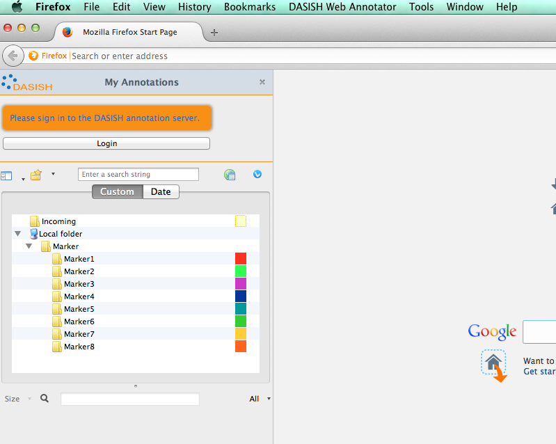
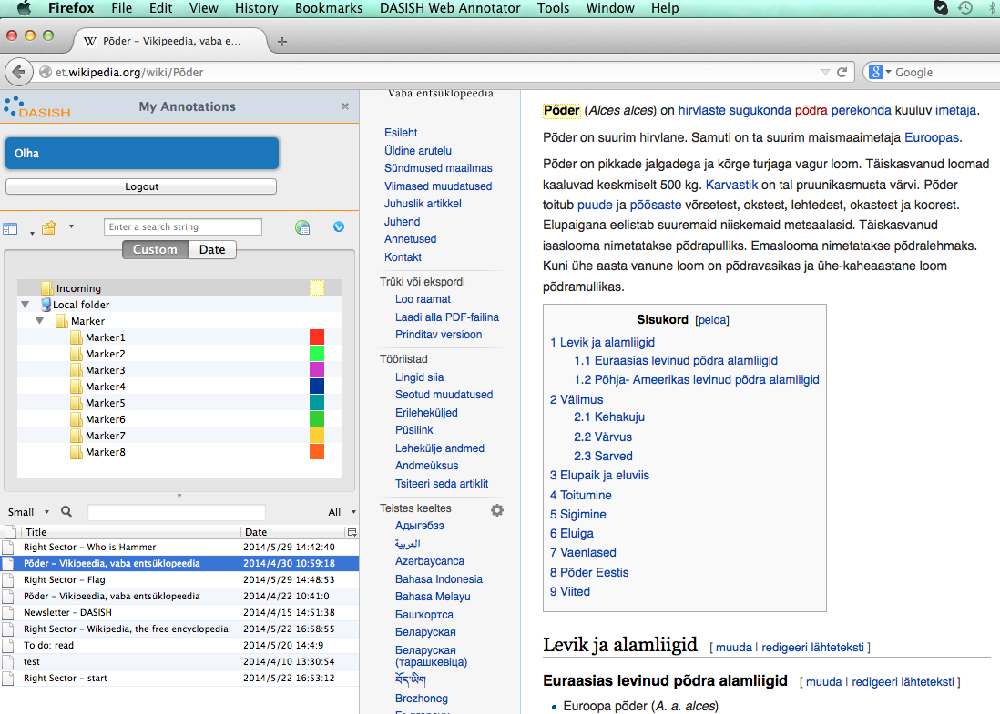
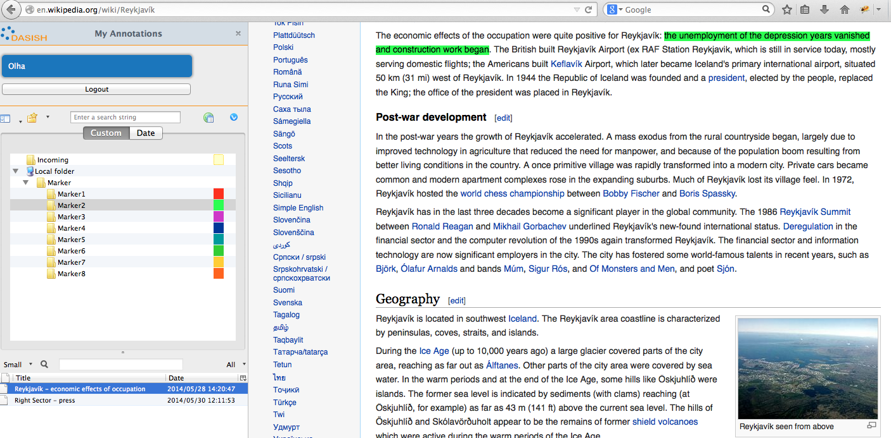
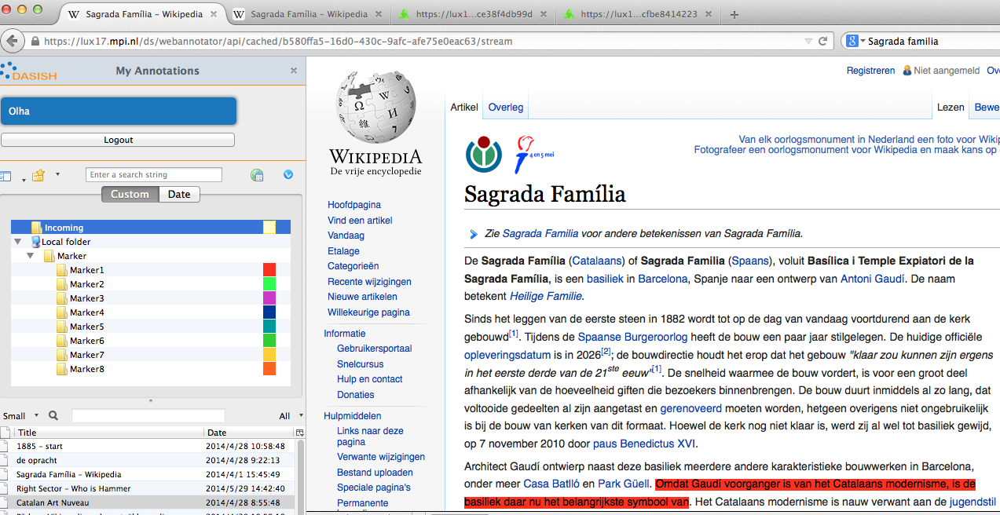
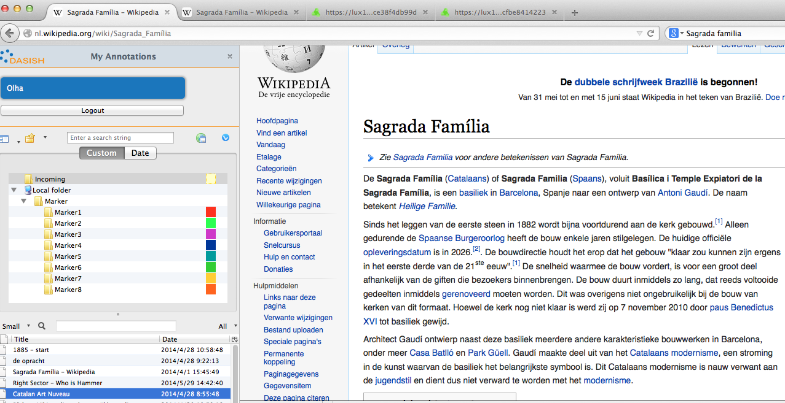
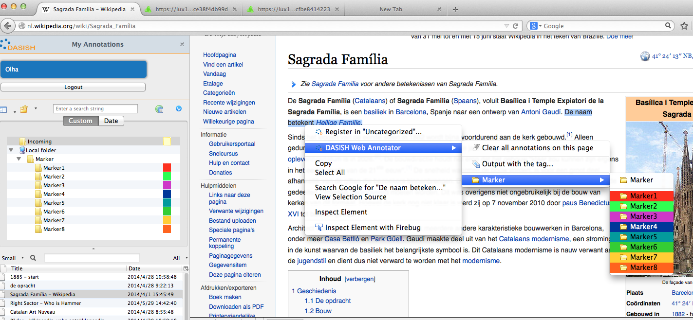
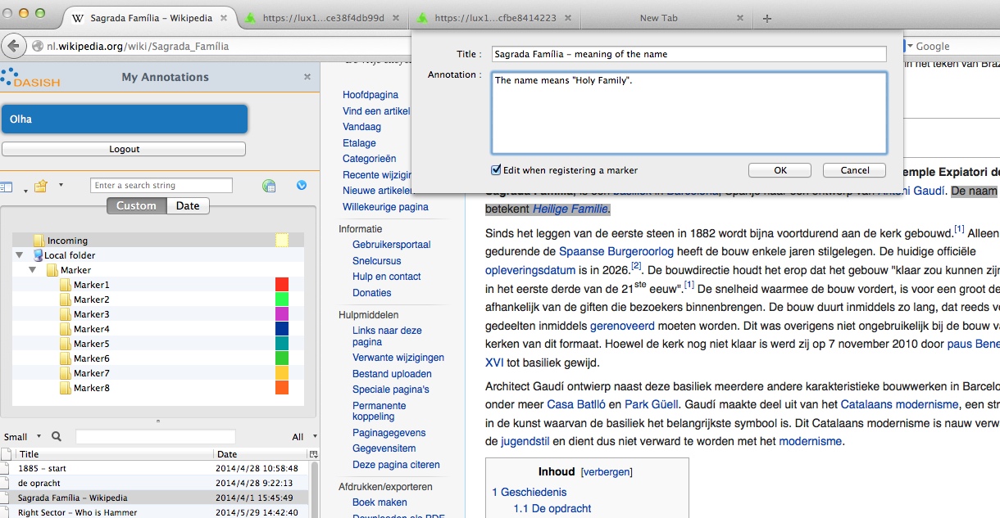
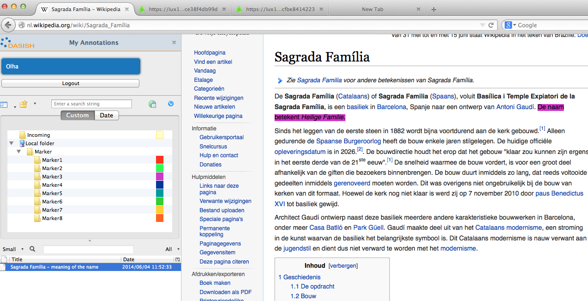

##Short how-to for DWAN wired-marker-based client

###Installation

Go to git-hub [GitHub's DASISH/dwan-client-wiredmarker repository](https://github.com/DASISH/dwan-client-wiredmarker) to download the extension. Follow the instructions and read the wiki-page referred from there. 

###Working with the client.
#### The first appearance
When the extension is properly installed and enabled you see the following screen:

#### Login
To have access to the database, that enables reading and posting annotations, you need to log-in.  Now we describe how to log-in if your institution is listed as a Shibboleth identity provider. Then you can just use your institution credentials.
* First, press "login" button and choose your institution or clarin as an identity provider.

* Second, provide your credentials and click "Login".

#### Seeing annotations of colleagues
They are listed in the incoming directory. Click "incoming". (If it is your first dwan-session with the page annotation of which you want to see, you need to browse to it.) Click on the annotation you want to see. It must appear on the web-page in the light-yellow colour. Unless it appears, refresh the page.

#### Getting your annotations

Annotations made by you are to be seen in the coloured folders according to the colours with which you have marked annotated texts. Click on the annotation you want to see. 

#### Unresolvable annotated source
If you want to see your or someonelse's annotation, and it does not appear after cliking on it and refreshing the page, it means that the client cannot resolve the annotated fragment. The most probable reason for it is that the web-page has been changed since it was annotated. Point the mouse to the annotation (in the list at the left-hand side) in question and righ-click. In the pop-up menu select "Cached representations" and click "open remote cache" in the sub-menu. You will see the cached annotation:

Compare this example cached representation with the example current web-page below, the annotation on which cannot be found:

As you see the annotated sentence has been changed.

#### Posting an annotation 

* Go to the web-page you want to annotate, select a text fragment by the mouse and obtain the marker's colour menu by right-clicking the mouse:

* Select the colour by left-clicking the mouse, and fill in the fields in the text-box for making an annotation.

* Click  "OK" in the box when you are done. The annotation should be shown on the page:

