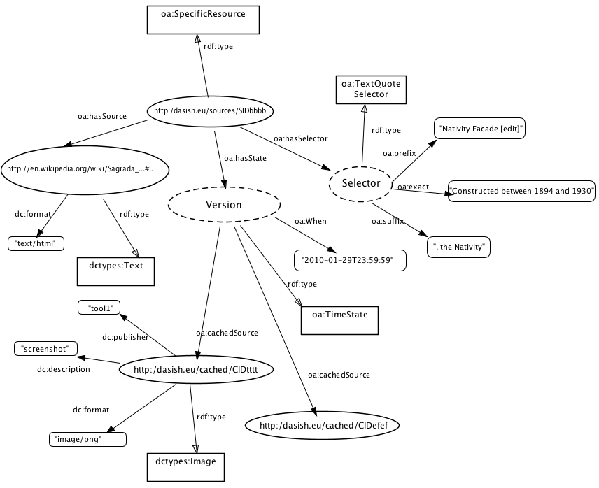

##Open Annotation Data Model

**TODO: this document may be obsolete: check with the current open-annotation documentation and update pictures, e.g. replace "users" with "principals"**.

The aim of this document is to show that annotations and related structures defined by DASISH xsd schema can be presented in "Open Annotation Data Model". Current "Open Annotation" requirements can be found at [http://www.openannotation.org/spec/core](​http://www.openannotation.org/spec/core).

This document refers to several images which are open-annotation representations of DASISH xml examples. The reader is encouraged to consult these images while reading the text. The dashed ovals in the images depict unresolvable uris, whereas the ovals with solid contours depict resolvable uris.

###Target Sources
Single target sources are represented as instances of ```oa:SpecificResource```. Example:



Multiple target sources are represented as instances of ```oa:Composite```. Each of ```oa:item``` of the composite is either an instance of ```oa:SpecificResource``` or ```oa:Composite```.

###Cached Representations
A cached representation of an annotated source (as ```oa:SpecificResource```) is referred via the source's state, see the figure above. The properties ```oa:hasState``` and ```oa:cachedSource``` are used. The metadata of the cached representation are presented via dc-properties and dctypes:

* mimeType is presented as ```​dc:format```,
* tool is presented as ​```dc:publisher```,
* type is presented as ​```dc:description```; note that ​```dc:type``` cannot be used here because its value must (recommended) be from the DCMI Type Vocabulary; therefore, e.g. "screenshot" would not be a good value here.
Moreover, a cached representation must have one of the dctypes as ```rdf:type```, and it must be compliant with dc:format value. For instance, if dc:format is "image/png" then the corresponding ```rdf:type``` must be ```dctypes:Image```.

###Principals
A principal, which is a user or a group of users, is an agent, and for agents "Open Annotation" standart recommends 
to use foaf namespace, see ​http://xmlns.com/foaf/spec/. This data model is designed for social networks, 
and in principle suits DASISH schema for a user and permission lists. There is one little technical inconvenience: 
foaf agents do not have a property which can be used to define permission types (reader, writer) directly. 
For now, permissions are represented via property ```foaf:topic_interest```. Example:


###Bodies
An annotation body in DASISH can be any correct xml or a text. A generic way to present such bodies in "Open Annotation" is to consider a body, which (typically) has attributes and elements, as instances of ````oa:Composite````. Any element and any attribute of the body becomes an oa:item of the body. If an element has sub-elements, it is an instance of oa:Composite as well, etc. An attribute or an element with now sub-elements has one of the dctypes and one of the dc:formtats, and possibly additional relevant properties, such as ````cnt:chars``` for text values. Example of an annotation with its properties and the detailed body:


Another example:


###Headlines
Any DASISH annotation contains a text element called headline. There is no direct way to represent such a headline in Open Annotation Data Model. In DASISH presentation it is an ```oa:item``` of a "big" body, called SuperBody which is an instance of ```oa:Composite```. Another item of SuperBody is the actual body of the annotation.

###Notebooks
Open Annotation does not define structures like "notebook" or "annotations collection", or similar. Nevertheless, a notebook can be presented as an annotation which body is title and target Annotations is an instance of ```oa:Composite```. Any annotation in the notebook becomes an ```oa:item``` of Annotations. Example:


