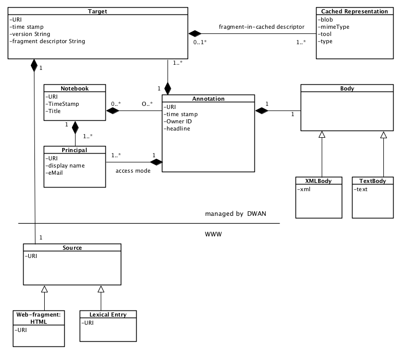

#DASISH Web-Annotator (DWAN)

###(TLA)


This document specifies a framework for annotating web-documents. We present the class structure of the implementation, describe the functionality from the user perspective and define the REST API.

Document version: 1.3

Date: 02 June 2014

Authors: 
Daan Broeder, Twan Goosen, Przemek Lenkiewicz, Olof Olsson, Stephanie Roth, Olha Shkaravska, Menzo Windhouwer.

##Technical Summary


The aim of this document is to give a specification of a framework for annotating web-documents. By an annotation we mean a remark over a fragment(s) of a document(s). For instance it can be a text note stating that a certain sentence in a web-document contradicts another sentence in the same document. This is an example of an annotation with two targets where a target is a sentence. Annotatable documents include, for instance, web-pages or web-documents generated by linguistic software, e.g. EAF-files, created by [ELAN](http://tla.mpi.nl/tools/tla-tools/elan/) .

From the technical point of view the proposed framework consists of the server part, called "a back-end", and possibly multiple clients, called "front-ends". Typically a client is developed specifically for a particular sort(s) of web-documents, whereas the server is not specific and treats requests of all clients in the same way. The core of the server part is a Data Base where annotations and information about corresponding annotated sources are stored together with cached representations of sources. A cached representation is a copy, e.g. a screenshot, of a source. Storing cached representations allows to retrieve the copy of an annotated document when the actual web-document under the source's URI has been updated so that localizing the annotation in it becomes difficult or even impossible. It may happen when the corresponding fragment has been significantly changed or disappeared. Archiving cached representations in the Data Base is especially relevant when annotated documents are dynamically changed pages like news sites or wiki-pages under construction.

The server part and an example client(s) are currently being implemented in the frame of [EU DASISH project](http://dasish.eu/).

A client exchanges data with the server by sending REST requests to the server. Client-request bodies and server's responds are presented as XML files. The main requirement for a client is that it should able to accept and send XML structures that obey a pre-defined XML schema. Then the server and the client will be able to understand each other. The schema is a part of the server-side software. The schema mirrors a data model that has been designed to represent the main data structures, which are involved in constructing annotations, and relations between these structures.


##Data Model


Class *Annotation* is the core of the model. The relations *Annotation - Target*, *Target - Source*, *Target - Cached Representation* closely follow the emerging [Open Annotations (OA) standard](http://www.openannotation.org/). An annotation, i.e. an inhabitant of the class *Annotation*, is a structure that contains necessary information about user's annotation. In particular it contains the annotation's identifier, the reference to the owner and the time of creation. An owner is either the user (or more generally, a principal) who has created the annotation or a user (principal) to whom the ownership has been assigned. A principal is ether a user or a group of users. Creating user's groups is the matter of the future work.

Besides the owner, an annotation has *readers* and *writers*. As one can expect, a reader is a user that can read the annotation, and a writer can also add changes to it. Thus, a registered user can be related to an annotation by means of one of three access modes (*owner*, *reader*, *writer*), or do not have an access to the annotation at all.

An annotation can have one ore more *target*s. A target (i.e. an inhabitant of the "Target" class) contains the reference to the web-document (a *source*) and the precise description of the document's fragment which is actually annotated. Moreover, a target may refer to one or more cached representations of the relevant parts of the source with the precise descriptions of the annotated fragments for each representation.

Semantics of an annotation is given in its body. In the implementation a body can be an arbitrary text or an xml text. In both cases a precise mime-type must be given by a client. For instance, a body can be a plain text which describes a relation (like contradiction) between two fragments of some web-document. In this case the body should contain references to the targets that represent these two fragments.

Annotations can be gathered in notebooks.



See [schema](http://lux17.mpi.nl/schemacat/schemas/s15/files/dwan.xsd)  the schema for serializing these classes, and examples. 

##REST Application Programming Interface


The server and a client communicate with each other by means of REST Application Programming Interface (API for short). REST API is a collection of requests which the server must recognise and respond in an appropriate way. Each request is an URL-like string starting with the server's location specified by the type of requested resource and its identifier when applicable. By resources we mean users (principals), notebooks, annotations, targets and cached representations.

GET requests are used to retrieve information about resources stored in the Data Base. For GET requests the string often ends with the identifier of a requested resource. This is a so called request parameter. For instance, it can be the identifier of an annotation or the identifier of a cached representation. Passing a user identifier as a parameter is not expected, because the active principal is known from the session via an identification procedure (e.g. "Shibboleth"). A PUT (resp. DELETE) request is used to update (resp. delete) the resource whose identifier is given as a request parameter. Only “owner” has DELETE rights. POST is performed when a client wants to create a new annotation. Some information necessary to fulfill a PUT or POST request is not given as a request parameter, but given serialized in a request body. For instance, to submit an annotation a client needs to fill in the requests body with the XML-element corresponding to class "Annotation". All the information necessary to create an annotation should be placed in the corresponding nodes of the XML-element. For instance, the link(s) to an annotated web-document(s) must be given in the POST's body.

If a POST (PUT) request is sent then in the case of success the server returns the serialized information about the added (resp. updated) resource together with a standard HTTP response code. In the case of failure the corresponding error message and error status are returned, e. g. 401 Unauthorized access if the principal is not logged in (except for the log-in service).

Below all requests are listed and the corresponding server responds are described in more detail.

**Notation**

---
| notation |  meaning |
|:----------|-----------:|
| ```aid``` | 	annotation identifier |
|```cid```	| cached-representation identifier|
|```datetime```	| date and time, including time zone, as defined in [http://www.w3.org/TR/xmlschema-2/#dateTime](http://www.w3.org/TR/xmlschema-2/#dateTime)|
|```nid```	 | notebook identifier |
| ```prefix``` | 	the prefix of a namespace |
| ```tid```	 | target identifier |
| ```text``` |	aome text |
| ```prid``` |	a principal id|
|```URI```	| URI, as defined in [http://tools.ietf.org/html/rfc3986](http://tools.ietf.org/html/rfc3986) |
| Principal	| a user (person) or a group of users |
---

Web-documents exist in time, that is different versions of the document may exist under the same link in different moments of time. As stated earlier, we will rely on local caching of versions of annotated sources, see Unresolvable targets in Scenario for an example. For now in this document the descriptions of the requests often refer to the corresponding descriptions on the Scenario wiki-page. It will be the other way around, i.e. the Scenario will refer to this specification document, after the implementation stabilizes.

###Principal realm

---
| Resource	| Description	| Return xml type |
|:----------|:--------------| -----------:|
| GET api/authentication/login | 	 logged-in principal if logged-in;otherwise redirects to the login page first |	 Principal |
|GET api/authentication/principal|	 logged-in principal |	 Principal|
|GET api/principals/```prid```	 | principal with the given prid | 	 Principal |
|GET api/principals/```prid```/current	 | ```true``` if the *prid* is logged-in; ```false``` otherwise |	 CurrenPrincipalInfo |
|GET api/principals/info?email=```... ``` | 	 see an example	 | Principal |
| GET api/principals/admin |	 The string with the name and the e-mail of DWAN admin	 | String |
---

###Annotations

**api/annotations**

---
| Resource	    | Description |Return xml type |
|:-------------|:--------------| -----------:|
| GET api/annotations?
link=```URI```&text=```text```&access=[["read", "write", "owner"]]&ns=```prefix```:ns&owner=```prid```&after=```datetime1```&before=```datetime2```|	returns a *filtered* by the request parameters list of info-s of the the annotations: for ```URI```, to which the unlogged ```prid``` has "read” (resp.”write”, "owner") access and the bodies of which contain the text ```text```. Moreover, these annotations are created between ```datetime1``` and ```datetime2```. If the parameter “link” is omitted, then considers all annotated objects to which ```prid``` has “read”/”write”/"owner" access. The default ```datetime1```is 01 Jan 1970, 00:00. The default ```datetime2``` is today.	| AnnotationInfoList|
|POST api/annotations	|Adds a new annotation by picking up its XML-serialization from the request body.	| Envelope AnnotationResponseBody|
---

**api/annotations/```aid```**

The table below describes the behavior of the request pair (method, URI) when principal ```prid``` has authorized access to ```aid```. Here “authorized access “ means that ```prid``` has “read” access for GET-methods, and “write” access for PUT body methods. Moreover, to change permissions of the annotation the principal must be the "owner" of the annotation. If the access is not authorised, then 401 is return.

---
| Resource      | Description | Return xml type |
|:--------------|:--------------| -----------:|
|GET api/annotations/```aid``` | returns the annotation that has this  ```aid``` | Annotation |
| GET api/annotations/```aid```/targets	| returns the list of the ```tid```-s of all the targets of ```aid```|	 ReferenceList |
|DELETE api/annotations/```aid```	| removes ```aid``` from the database, together with all its targets to which no other annotation refers |   http status code, no xml |
|PUT api/annotations/```aid```| updates the annotation with ```aid```. For instance, it is used when ```prid``` wants to correct typos in the annotation body AND change annotated fragments. (See PUT api/annotations/```aid```/body for correcting body only.) The serialized representation of the updated annotation is given in the request body. The server returns an "envelope" containing the updated annotation and the list of actions.| Envelope AnnotationResponseBody |
| PUT api/annotations/```aid```/body | updates the body of the annotation ```aid```. Used e.g. for correcting typos in the text part. The server returns the "envelope", see above.	| Envelope AnnotationResponseBody |
| GET api/annotations/```aid```/permissions | see getting permission lists | PermissionList |
| PUT api/annotations/```aid```/permissions	| see updating permission lists	| envelope PermissionResponseBody |
| PUT api/annotations/```aid```/permissions/```prid``` | see adding/updating access	 | http status code |
---

###Targets###

A target represents a specific fragment of a specific version of an annotatable source. For instance, if a source is a web-page that was lastly updated on 12.12.2012 at 14:00 in Berlin then target contains the link to the page and the time stamp for 14:00 (CET) on 12.12.2012. These date and time may differ from the date and time of creating annotations on this source. Some sources contains explicit version strings like "Version 2.1". Such version string is represented as an attribute of a target as well.

**api/targets**

---
| Resource | Description | Return xml type |
|:--------------|:--------------| -----------:|
| GET api/targets/```tid```	| returns the target with a given id |	 Target |
| GET api/targets/```tid```/versions |	 returns the lists of the URIs of all the “sibling”-versions of the ```tid```, that is targets related to the same source (the same link) |	 ReferenceList |
|POST api/targets/```tid```/fragment/```fragmentdescriptorstring```/cached	| a 2-part POST, with the request body consisting of a description CachedRepresentationInfo class, and a single file (multiple files must be archived) |	CachedRepresentationInfo |
| DELETE api/targets/```tid```/cached/```cid```	| removes connection ```tid```-```cid```s. The cached representation is removed from the database as well, unless there are no more references to this representation.	|  status code, and string "how many rows in the junction table are removed", should be 0 or 1  |
---

**api/cached**

It is possible to store the cashed representation not only of the fragment precisely corresponding to annotation's target but of a larger fragment and even of the entire annotatable document. The relation between the target and its cached representation should be completed by a fragment descriptor pointing to the position of the annotated fragment in the cached representation. For instance, for a screenshot it may be an (x,y) -position of a left-upper corner of the annotated fragment and the size of a rectangular.

---
| Resource | Description | Return xml type |
|:--------------|:--------------| -----------:|
| GET | api/cached/```cid```/metadata | returns the meta-information of ```cid``` if it exists |	 CachedRepresentationInfo |
| GET api/cached/```cid```/stream | returns the file (stream) that is the cached representation with ```cid``` if it exists |	 no xml output |
| GET api/cached/```cid```/content | returns the image file that is the cached representation with ```cid``` if it exists | no xml output |
---

###Notebooks (implemented but not checked at all)

**api/notebooks**

---
| Resource | Description | Return xml type |
|:--------------|:--------------| -----------:|
| GET api/notebooks | returns notebook-infos for the notebooks accessible to the current principal | NotebookInfoList |
| GET api/notebooks/owned| returns the list of all notebooks owned by the current logged principal | ReferenceList |
| GET api/notebooks/```nid```/readers | returns the list of ```prid``` who allowed to read the annotations from the notebook | ReferenceList |
| GET api/notebooks/```nid```/writers | returns the list of ```prid``` that can add annotations to the notebook | ReferenceList |
| GET api/notebooks/```nid```/metadata | get all metadata about a specified notebook ```nid```, including the information if it is private or not | 	Notebook | 
| GET api/notebooks/```nid```?
maximumAnnotations=limit&startAnnotation=offset&orderby=orderby&orderingMode=```[[1,0]]```|  get the list of all annotations ```aid```-s contained within a Notebook with related metadata. Parameters: ```nid```, optional maximumAnnotations specifies the maximum number of annotations to retrieve (default -1, all annotations), optional startAnnotation specifies the starting point from which the annotations will be retrieved (default: -1, start from the first annotation), optional orderby, specifies the RDF property used to order the annotations (default: dc:created ), optional orderingMode specifies if the results should be sorted using a descending order desc=1 or an ascending order desc=0 (default: 0 ) | 	ReferenceList | 
| PUT /notebooks/```nid``` | 	modifies metadata of ```nid```. The new notebook’s name must be sent in request’s body.	 | Envelope NotebookResponseBody | 
| PUT /notebooks/```nid```/```aid``` | 	adds an annotation ```aid``` to the list of annotations of ```nid``` | 	 Envelope NotebookResponseBody | 
| POST api/notebooks/ | creates a new notebook.  This API returns the ```nid``` of the created Notebook in response’s payload and the full URL of the notebook adding a Location header into the HTTP response. The name of the new notebook can be specified sending a specific payload | Envelope NotebookResponseBody | 
| DELETE api/notebooks/```nid``` | delete ```nid```. Annotations stay, they just lose connection to ```nid``` | https status, no xml | 
| POST api/notebooks/```nid```	|  creates a new annotation in ```nid```. The content of an annotation is given in the request body. In fact this is a short cut of two actions: POST api/annotations and PUT /notebooks/```nid```?annotation=```aid```.| 	 Envelope NotebookResponseBody |
---


## Appendix 1 
For Appendix 1 please see the [DOC](https://trac.clarin.eu/raw-attachment/wiki/DASISH/SpecificationDocument/DASISH-Annotator-1.1-snapshot.docx) file of this document. Note that it is obsolete except its Appendix.
